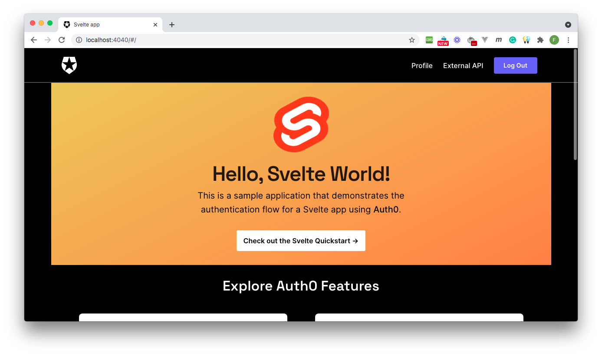

# Hello, Svelte World!

This sample uses the [Auth0 SPA SDK](https://github.com/auth0/auth0-spa-js) to implement the following security tasks:

- Add user login and logout.
- Retrieve user profile information.
- Protect application routes.
- Make secure calls to an API.



## Quick Auth0 Set Up

### Set up the project

Install the project dependencies:

```bash
npm install
```

### Register a Svelte application with Auth0

- Open the [Applications](https://manage.auth0.com/#/applications) section of the Auth0 Dashboard.

- Click on the **Create Application** button.

- Provide a **Name** value such as _Hello World Client_.

- Choose "Single Page Web Applications" as the **application type**.

- Click on the **Create** button.

> View ["Register Applications" document](https://auth0.com/docs/applications/set-up-an-application) for more details.

Your Auth0 application page loads up.

Your Svelte application will redirect users to Auth0 whenever they trigger an authentication request. Auth0 will present them with a login page. Once they log in, Auth0 will redirect them back to your Svelte application. For that redirecting to happen securely, you must specify in your **Auth0 Application Settings** the URLs to which Auth0 can redirect users once it authenticates them.

As such, click on the "Settings" tab of your Auth0 Application page and fill in the following values:

**Allowed Callback URLs**

```bash
http://localhost:4040
```

**Allowed Logout URLs**

```bash
http://localhost:4040
```

**Allowed Web Origins**

```bash
http://localhost:4040
```

**Scroll down and click the "Save Changes" button.**

### Connect Svelte with Auth0

Create a `.env` file under the project directory and populate it as follows:

```bash
SVELTE_APP_AUTH0_DOMAIN=
SVELTE_APP_AUTH0_CLIENT_ID=
SVELTE_APP_AUTH0_AUDIENCE=https://hello-world.example.com
SVELTE_APP_API_SERVER_URL=http://localhost:6060
```

Head back to your Auth0 application page. Follow these steps to get the `SVELTE_APP_AUTH0_DOMAIN` and `SVELTE_APP_AUTH0_CLIENT_ID` values:


1. Click on the "Settings" tab, if you haven't already.

2. Use the "Domain" value from the "Settings" as the value of `SVELTE_APP_AUTH0_DOMAIN` in `.env`.

3. Use the "Client ID" value from the "Settings" as the value of `SVELTE_APP_AUTH0_CLIENT_ID` in `.env`.

### Run the project

With the Auth0 configuration set, run the Svelte application by issuing the following command:

```bash
npm start
```

Visit [`http://localhost:4040/`](http://localhost:4040/) to access the application.

## Advanced Auth0 Set Up

### Connecting to an external API

The external API used in this Svelte sample is the ["Hello World API: Express.js Sample"](https://github.com/auth0-sample-gallery/api_express_javascript_hello-world).

Follow the instructions on that `README` of that repository to set up and run the API.

Once set up, you can see the different server responses by interacting with the message box present in [`http://localhost:4040/external-api`](http://localhost:4040/external-api).

### Admin access

When you log in to the application and visit the `/external-api` page, you have different options to test to connection between your Svelte application and a remote API server. You can retrieve a public, protected or admin message.

Requesting the protected message requires Svelte to send an access token with the server request. On the other hand, requesting the admin message requires Svelte to send an access token with the server request that also has the `read:admin-messages` permission.

You can use the Auth0 Dashboard to create an `admin` role and assign it the`read:admin-messages` permission. Then, you can assign the `admin` role to any user that you want to access the `/admin` endpoint.

If you need help doing so, check out the following resources:

- [Create roles](https://auth0.com/docs/authorization/rbac/roles/create-roles)

- [Create permissions](https://auth0.com/docs/get-started/dashboard/add-api-permissions)

- [Add permissions to roles](https://auth0.com/docs/authorization/rbac/roles/add-permissions-to-roles)

- [Assign roles to users](https://auth0.com/docs/users/assign-roles-to-users)
